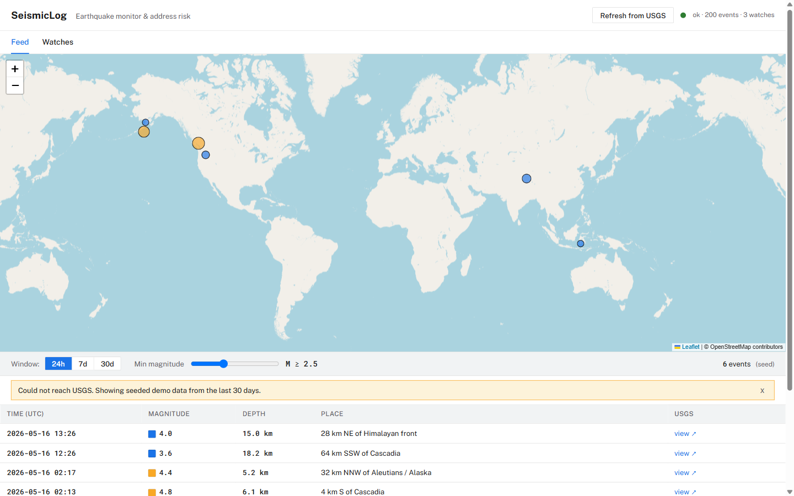

[Смотреть демо](./seismiclog.mp4)
# SeismicLog

Earthquake monitor with per-address long-term risk briefings.



## The problem this addresses

The United States Geological Survey publishes every earthquake in the
world, in close to real time, in machine-readable form. What it does not
publish is an answer to the question a person actually asks:

> *Is the place where I live, or where my family lives, getting more or
> less seismically active over time, and how does that compare to other
> places I could be?*

National hazard models exist, but they are decadal products consumed by
engineers and insurers, not by residents. Newsroom coverage skews toward
single large events and rarely contextualises a magnitude-4 in a region
that has logged twenty such events this year. SeismicLog occupies the
gap: a permanent record of regional activity around addresses the user
cares about, refreshed from the USGS GeoJSON feed, summarised in plain
English by a small language model.

## Who this is for

| Audience                              | Use case                                                      |
|---------------------------------------|---------------------------------------------------------------|
| Homeowners in known seismic regions   | Track local activity month over month, brief family by email. |
| Prospective buyers, expats, students  | Compare two candidate cities on the same metric.              |
| Small school or clinic operators      | Annual safety review, attached to the building file.          |
| Risk-curious general public           | Replace doomscrolling earthquake Twitter with a calm log.     |

SeismicLog is **not** a real-time tsunami warning system, an official
hazard assessment, or a substitute for compliance with local building
code. The disclaimer at the bottom of every page says so.

## What is in the box

A global feed (24 h / 7 d / 30 d windows, magnitude filter, map and
table), an unlimited list of watch addresses, and a two-paragraph
risk briefing per watch generated by an LLM with deterministic local
fallback. The seed database contains 200 events and three demo watches
so the application is fully functional with no network and no API keys.

## What it does

- Live global earthquake feed (24 h / 7 d / 30 d) sourced from the USGS
  public GeoJSON service, with a map and table view.
- A list of "watch" addresses (home, family, secondary residence) with
  per-address risk metrics computed from the local seismic record.
- A two-paragraph plain-English briefing for each watch, generated by
  an LLM provider chain that falls back to a local template when no
  API key is configured.

## Stack

Python 3.12, Flask 3, SQLAlchemy 2 (typed declarative), marshmallow 3,
gunicorn (two workers, threaded class) on port 8002. SQLite at
`data/seismiclog.db`. Frontend is a single server-rendered HTML page
with vanilla JavaScript and Leaflet 1.9 for the map. Fonts: Public
Sans and Roboto Mono from Google Fonts. The HTTP client uses the Python
standard library `urllib.request` exclusively; no `requests` or
`httpx`.

## Run with Docker

```sh
cp .env.example .env
docker compose up --build
```

## Run without Docker

```sh
python -m venv .venv
. .venv/bin/activate
pip install -r requirements.txt
cp .env.example .env
flask --app wsgi run --port 8002 --debug
```

## Environment

| Variable             | Default                                      | Purpose                                          |
|----------------------|----------------------------------------------|--------------------------------------------------|
| `OPENROUTER_API_KEY` | unset                                        | Enables OpenRouter as the primary LLM provider.  |
| `OPENROUTER_MODEL`   | `meta-llama/llama-3.3-70b-instruct:free`     | Model id for OpenRouter.                         |
| `ANTHROPIC_API_KEY`  | unset                                        | Enables Anthropic as the secondary LLM provider. |
| `ANTHROPIC_MODEL`    | `claude-haiku-4-5`                           | Model id for Anthropic.                          |
| `DEMO_OFFLINE`       | `0`                                          | `1` to skip all external calls.                  |
| `DATABASE_URL`       | `sqlite:////app/data/seismiclog.db`          | Overridable for tests.                           |
| `FLASK_ENV`          | `production`                                 | `development` enables the Flask debugger.        |
| `PORT`               | `8002`                                       | Gunicorn bind port.                              |

## AI features

SeismicLog uses an LLM in two places. Both share the same provider chain
(OpenRouter -> Anthropic -> local template) and remain functional with
no API keys.

- **Risk briefing.** When a watch address is created the backend builds
  a prompt from the 30-year event count within 100 km, the largest
  observed magnitude and its date, the dominant depth band, the
  inferred Vs30 soil class, and the heuristic probability of a M>=5
  within 30 years. The model returns two short paragraphs: what the
  historical record actually shows, and what the probability means for
  this household plus one preparation action that fits the tier. The
  briefing is cached on the `RiskAssessment` row and re-rendered on
  demand via the Recompute button.
- **Personal prep checklist.** Below the briefing the watch detail
  exposes a building-type selector (house / apartment / office). On
  click (`POST /api/watch/{id}/checklist?building_type=...`) the backend
  classifies the address into a low / moderate / elevated risk tier
  from `p_m5_30y` and asks the model for six concrete prep items in
  the order structure / secure-objects / supplies / drill / document /
  neighbour-coordination. Items are rendered as a numbered list with a
  coloured risk-tier chip. The local fallback returns hand-written
  checklists for every (tier, building_type) combination.

## AI provider priority

1. OpenRouter, when `OPENROUTER_API_KEY` is set.
2. Anthropic, when `ANTHROPIC_API_KEY` is set.
3. Local template fallback (always available, no network required).

## Data sources

Earthquake data from the United States Geological Survey, distributed
under CC0. Geocoding and map tiles from OpenStreetMap, distributed
under the Open Database License (ODbL).

## Disclaimer

Risk numbers shown by SeismicLog are a heuristic derived from the
local rate of magnitude 4 events in the seismic record. They are not a
USGS official forecast and they are not a substitute for an official
national seismic hazard assessment. Real forecasts require a national
seismic hazard model.

## License

See the repository root LICENSE file.
